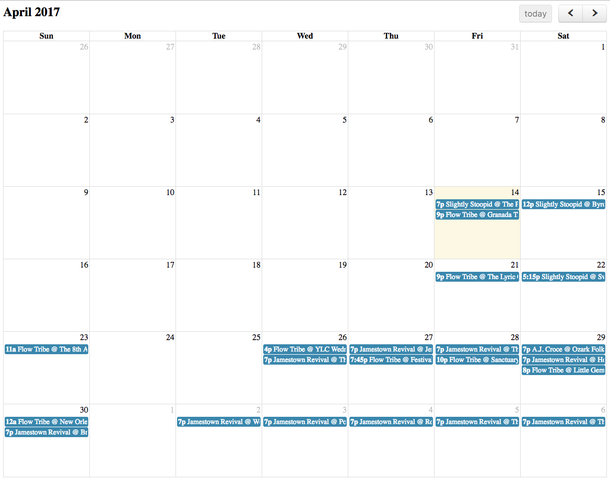

# Bandsintown Calendar

An easy to install calendar that displays all the artists events.

## Goals
* Build a Bandsintown events aggregator that returns events for more than one artist

## Example

### Basic

```html
<html>
  <head>
    <link rel='stylesheet' href='https://bandsintown-calendar-assets.s3.amazonaws.com/bit.css' />
    <script src="https://bandsintown-calendar-assets.s3.amazonaws.com/bit.js"></script>
  </head>

  <body>
    <div id="calendar" data-bandsintown-ids=["A.j.Croce","Jamestown%20Revival","Flow%20Tribe","Slightly%20Stoopid"]>
    </div>
  </body>
</html>
```



## Deploying

In the root of the project, run the following for deploying the Bandsintown aggregator handler code to an AWS lambda function, and for pushing the static assets for the calendar to AWS S3.

`python3 tasks/deploy_lambda_function.py`
`python3 tasks/deploy_static_assets.py`
